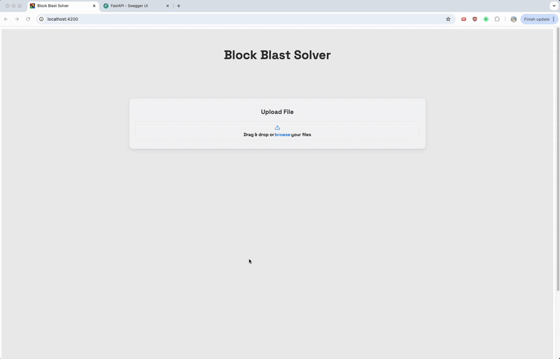

# Block Blast Solver

Welcome to the Block Blast Solver project! This project started with a simple addiction to the game [Block Blast](https://apps.apple.com/us/app/block-blast/id1617391485). My goal was to create a solver that could analyze a screenshot of the game and suggest the best possible moves.

## Features

- Analyze game screenshots to suggest optimal moves.
- Simple and intuitive user interface.

## Getting Started

To get started with the Block Blast Solver, ensure you have Python and Angular set up on your machine.

### Prerequisites

- **Python**: Ensure Python is installed. [Download Python](https://www.python.org/downloads/)
- **Angular**: Ensure Angular CLI is installed. [Get Started with Angular](https://angular.io/guide/setup-local)

### Installation

1. **Clone the repository**:
      ```bash
      git clone https://github.com/vineeth14/BlockBlastSolver.git
      cd BlockBlastSolver
   ```

2. **Start the solver**:
   ```bash
   fastapi dev main.py
   ```

3. **Start the frontend**:
   ```bash
   ng serve -o
   ```

4. **View the solver**:
   Open your browser and navigate to `http://localhost:4200` to see the solver in action.

## Usage

- Upload a screenshot of your current game state.
- The solver will analyze the image and suggest the best moves.
- Use the suggested moves to improve your score and beat your friends!

## Blog Post

For more insights into the development process, check out my [Solving Block Blast](https://vineeth14.github.io/BlockBlastSolver/docs/index.html) blog post.

## Results

Here's a look at the final results!



## Contributing

Contributions are welcome! Please fork the repository and submit a pull request for any improvements or bug fixes.

## License

This project is licensed under the MIT License - see the [LICENSE](LICENSE) file for details.

## Contact

For any questions or feedback, please contact me on [LinkedIn](https://www.linkedin.com/in/vineethrajesh/).
