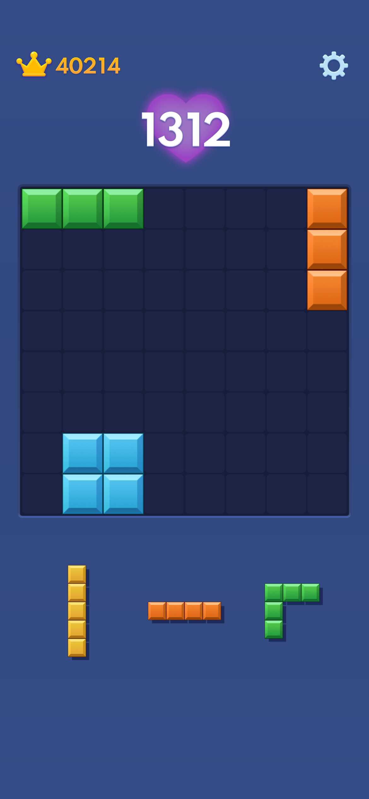
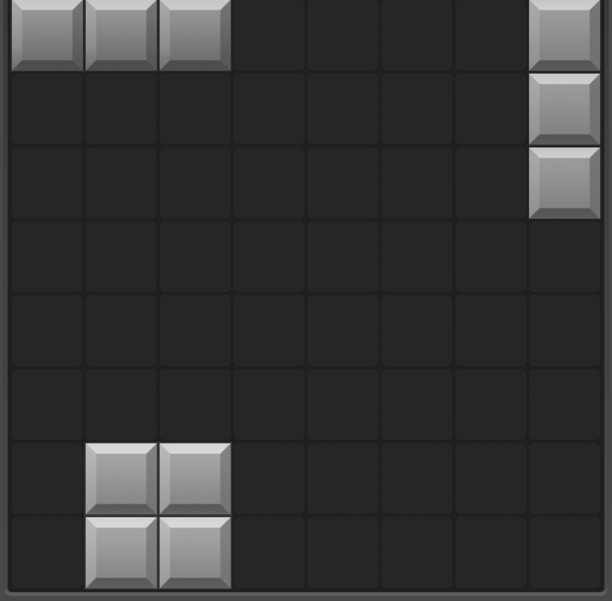
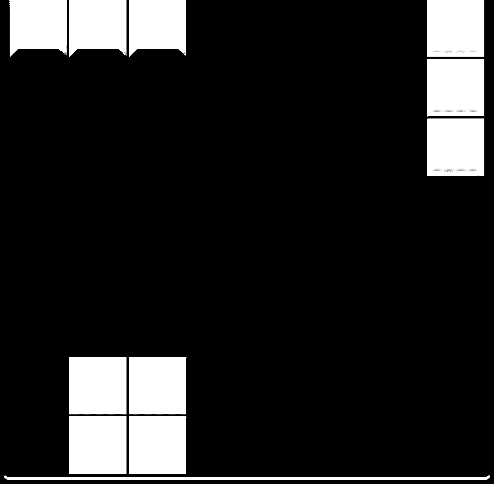

<!-- Include the custom CSS file if not already loaded by your layout -->
<link rel="stylesheet" href="{{ '/assets/css/custom.css' | relative_url }}">

    <h1>Building a Block Blast Solver </h1>

    <h2>Table of Contents</h2>
    <ul>
        <li><a href="#introduction">Introduction</a></li>
        <li><a href="#challenges-faced">Challenges Faced</a></li>
        <li><a href="#game-state-recognition">Game State Recognition</a>
            <ul>
                <li><a href="#goal">Goal</a></li>
                <li><a href="#approach-1-simple-image-processing">Approach 1: Simple Image Processing</a></li>
                <li><a href="#approach-evolution">Approach Evolution</a></li>
                <li><a href="#final-approach-color-detection">Final Approach: Color Detection</a></li>
            </ul>
        </li>
        <li><a href="#approach-to-game-logic">Approach to Game Logic</a>
            <ul>
                <li><a href="#solution-evolution">Solution Evolution</a></li>
                <li><a href="#scoring-methodology">Scoring Methodology</a></li>
            </ul>
        </li>
        <li><a href="#future-improvements">Future Improvements</a></li>
    </ul>

## Introduction

This project started with a simple obsession—[Block Blast](https://apps.apple.com/us/app/block-blast/id1617391485). The satisfaction of beating my friends' high scores, when we were in a friendly competition to see who could get the highest score got me thinking about whether I could build a solver that could give me the best possible moves.

<blockquote class="highlight">
Block Blast is a Tetris inspired puzzle game where you drag and drop the pieces onto a 8x8 board and can clear both rows (like in Tetris) and columns; the pieces don't fall, you are presented with three at a time and drag them onto the board. You lose in a fashion similar to Tetris -- when there is no longer room to place a piece.
The game's simplicity is its charm, but don't be fooled—mastering Block Blast takes skill, strategy, and a sharp mind.
</blockquote>

I wanted a program that could analyze a screenshot when I was stuck and suggest the best moves. I decided to stay away from using AI as that seemed to defeat the challenge of the project.

## Challenges Faced

The development process came with several interesting challenges:

| Challenge | Description |
|-----------|-------------|
| Game State Recognition | Block Blast does not have a defined set of shapes like Tetris. Capturing and understanding the game state accurately, including different block colors and patterns. |
| Game Logic | Block Blast has a unique game logic that requires a custom approach to solving the game. |
| Performance Optimization | Finding the right balance between speed and accuracy while managing computational resources. |

## Game State Recognition

The first challenge was to capture the game state accurately. This was challenging because the game does not have a defined set of shapes or colors used. I tried a few approaches:

### Goal
> Finding a simple solution to convert the uploaded image of the game board and the blocks within it to a 2D array of 0s and 1s respectively.

### Approach 1: Simple Image Processing

1. Crop image into 2 parts: the game board and the game pieces
2. Convert image to grayscale
3. Crop image to isolate the region of interest
4. Apply binary thresholding to convert grayscale to black and white
5. Resize binary image to a smaller grid (e.g., 8x8)
6. Convert resized image to a NumPy array where any pixel value of 255 is converted to 1

#### Visual demonstration of the process:

  

    
    
Step 1: Original Screenshot

  

  
  
→

  
  

    
    
Step 2: Grayscale

  

  
  
→

  
  

    
    
Step 3: Binary

  

  
  
→

  
  

    <pre style='background-color: #fff; padding: 15px; border-radius: 4px; box-shadow: 0 2px 4px rgba(0,0,0,0.1); font-family: monospace; margin: 0;'>[[1 1 1 0 0 0 0 1]
[0 0 0 0 0 0 0 1]
[0 0 0 0 0 0 0 1]
[0 0 0 0 0 0 0 0]
[0 0 0 0 0 0 0 0]
[0 0 0 0 0 0 0 0]
[0 1 1 0 0 0 0 0]
[0 1 1 0 0 0 0 0]]</pre>
    
Final Matrix

  

### Approach Evolution

#### Why the first method failed for game pieces:
- Inaccurate results as shapes cannot be predefined as they are randomly generated.
- Background color interference made simple image processing unreliable
- Inconsistent results as shapes can be different shades of blue and because the background color is a shade of blue, it was difficult to do simple image processing and get a consistent binary image.

### Approach 2: Using HSV Ranges

Attempted using HSV ranges to extract the shapes from the cropped images:

- This doesn't work because I suspect that some of the colors used are randomly generated or the number of colors used is larger than I cared to manually identify.
- So hard coding the HSV color values wouldn't work consistently.

### Final Approach: Color Detection

After trying the above approaches, I decided to develop a color detection system to extract the shapes from the cropped images that would work consistently.
This proved to be quite challenging as it was difficult to get consistent results with this approach. It was easy to find the shape, but accurately obtaining the correct number of blocks of the shape was extremely inconsistent due to factors like image quality and resolution. I applied a number of techniques to improve the accuracy of the detection.

My color detection system consisted of 3 main steps:

#### Grid-Based Scanning
1. The game board is divided into a grid where each cell represents a potential block position.
2. Each cell is scanned systematically using a fixed block size (58 pixels) and small offset (10 pixels). 
3. This creates a consistent sampling pattern regardless of the board's current state.

#### Multi-Point Sampling Strategy
1. Instead of relying on a single pixel, each grid cell is sampled at 11 points.
2. This multi sample approach helps handling color variations and potential image noise.

#### Color Matching Algorithm
For each sampled point:
1. Compare the pixel's RGB values against a reference background color (48, 74, 139)
2. Count both background matches and block (non-background) matches
3. Calculate a ratio of block pixels to total valid samples
4. Consider a cell to contain a block if more than 40% of samples are non-background

After the grid is scanned, the results are represented as a 2D array of 0s and 1s where 1s represent blocks and 0s represent background.

---

## Approach to Game Logic

Now that we have detected the game board and the game pieces, we can start to think about the game logic.

### Goal
> Suggest the best possible moves given the current game state.

### Does the game make us lose on purpose?

I say this because at the beginning of a game, we can very clearly see that the proposed pieces are strangely perfect—they are exactly the pieces needed to complete a row or a column. So, the game is clearly aware of the pieces we need, and at the start of the game at least, it helps us. This was an interesting observation I noticed.

### Solution Evolution

The solver uses:

**Board Representation**
  - 2D array structure
  - Optimized pattern matching

The final strategy I developed is a combination of brute force and a scoring system that would reward moves based on piece position. 
The best position for each piece that will yield the highest score, we go through all possible positions for all pieces in all possible orders. Piece 1, then 2, then 3, then 1, then 3, then 2, etc. This is therefore a brute-force method, which takes a lot of time, especially when there are few pieces already placed on the board.
The game rewards a player for completing rows and columns, so we want to maximize the number of rows and columns completed so I added an extra bonus to the score to emphasize this in the algorithm.
I also penalize the creation of isolated blocks, meaning that if a move results in a single block surrounded by empty spaces at the end of a turn, it is penalized.

### Scoring Methodology

| Factor | Impact |
|--------|---------|
| Neighbors | Increase score plus for each neighbor |
| Border placement | Increase score plus for each border placement |
| Completed rows/columns | Reward a bonus of 50 points|
| Isolated blocks | Score penalty |
| Holes | Score penalty |

The brute-force method can take a long time if the board is relatively empty.
So, I added the below optimization:
- If the game state is has a board with less than 15 squares filled, I skip boards(valid placements) with same score, as doing it earlier would take too much time and also has no real value when there are no pieces yet.

**Over Optimization**:
Something I ran into when trying to optimize the scoring methodology was increasing the score for partially completed rows/columns. This led to over-rewarding boards that have many filled cells even when they are not close to becoming complete. This can mislead the solver into choosing moves that rack up a lot of temporary points without actually progressing toward clearing rows/columns.

### Future Improvements
- [ ] Enhanced pattern recognition
- [ ] Special piece handling
- [ ] Improved Scoring Methodology

[View Project on GitHub](https://github.com/vineeth14/BlockBlastSolver)

